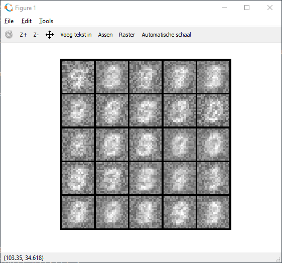

# Exercise 4 (week 5: Neural Networks Learning)

Implements the backpropagation algorithm and applies it to the task of hand-written digit recognition (MNIST).

Key files:
* nnCostFunction.m - calculates cost function and gradient

Key characteristics:
* Dataset: 5000 images, 20x20 pixels, categorized {1,2,...,10} (10=0)
* Neural network: 
  * Input layer : s=400+1
  * hidden layer: s=25+1
  * output layer: s=10
* Activation function: sigmoid; Regularization
* Optimization algo: fmincg.m (built in)

We achieve a 100% accuracy on the testdata. The figure below shows how the weights emerge during optimization (first 10 iterations shown). Each square represents the (400x1) weight vector of the i-th unit (reshaped into (20x20) matrix, plotted using imagesc.m).

