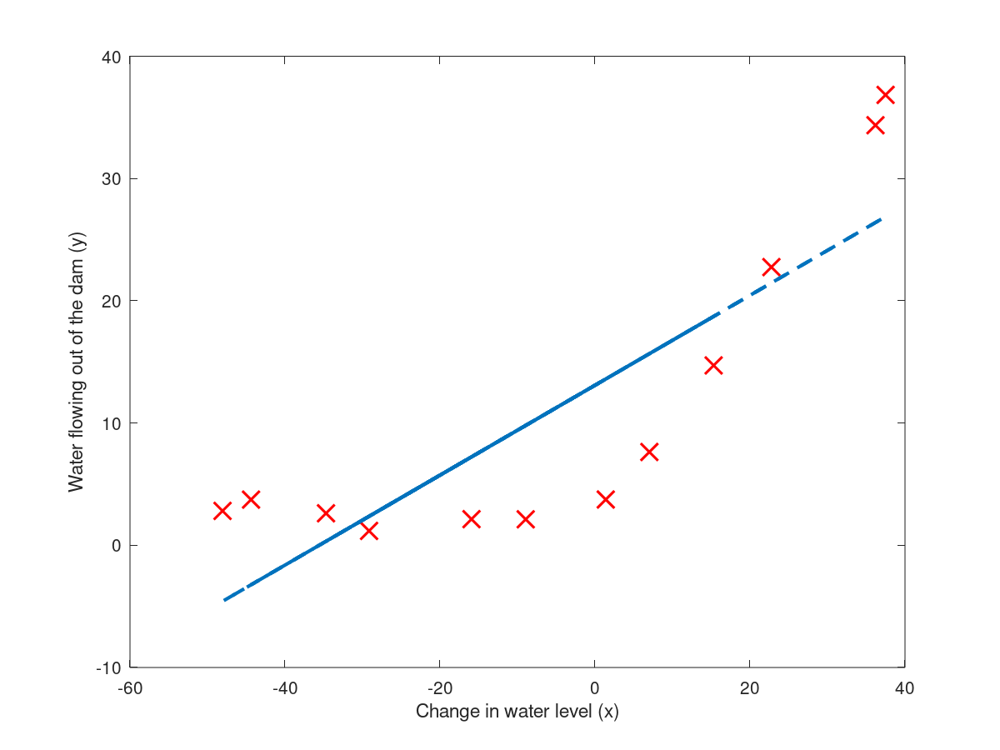
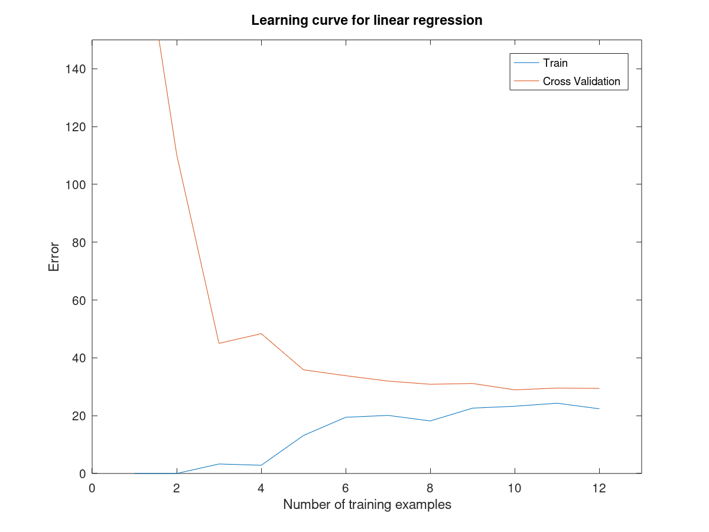
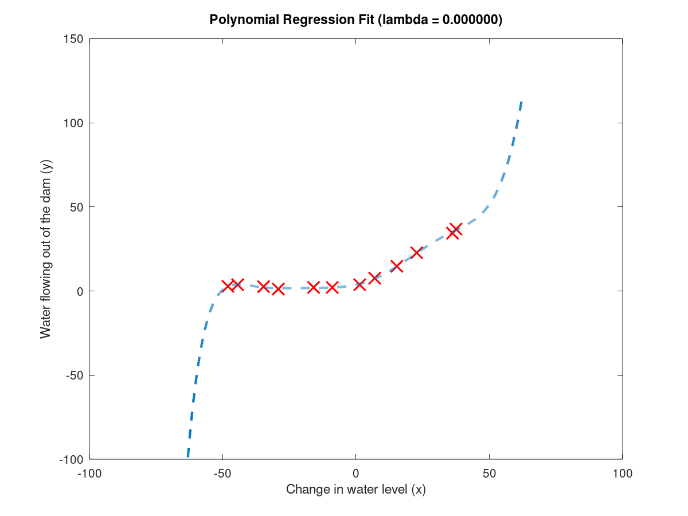
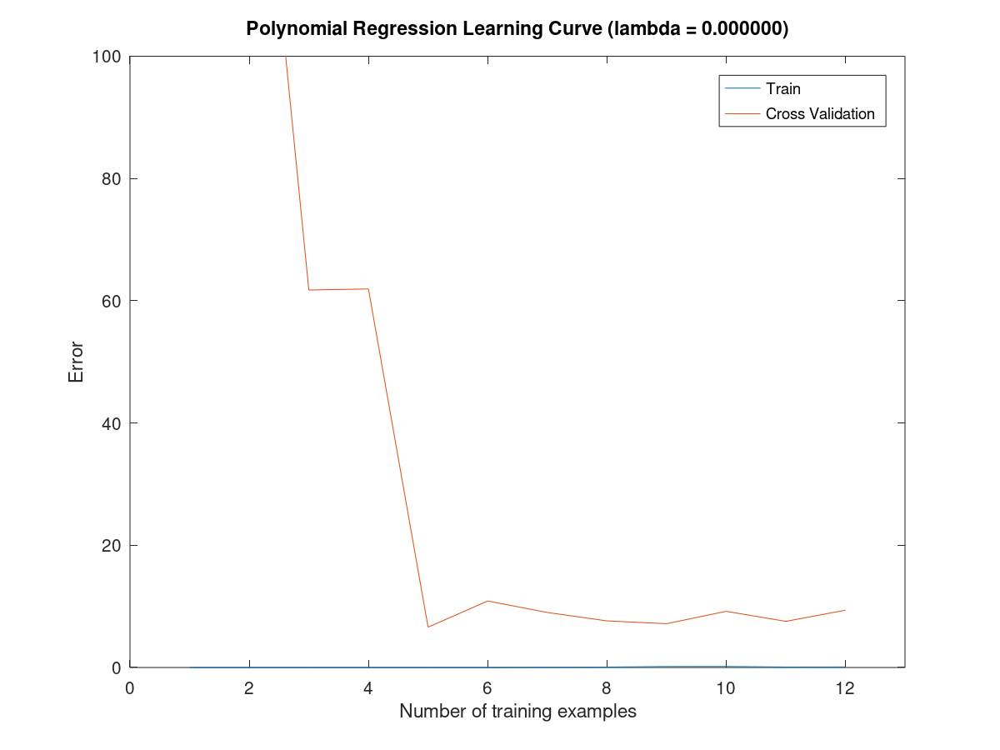
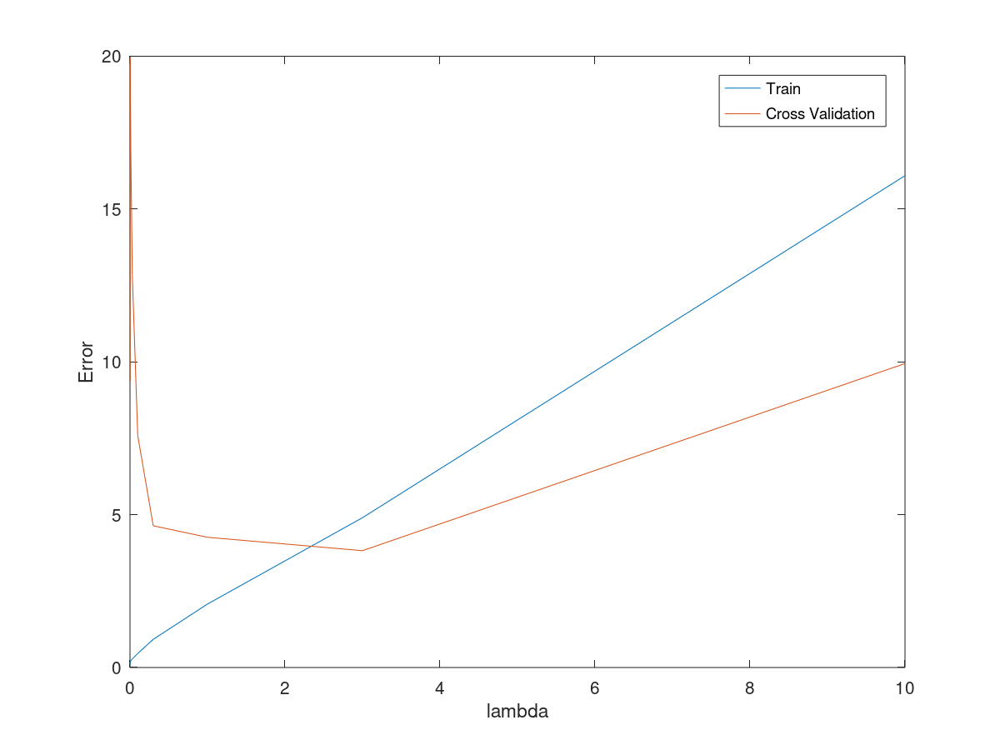
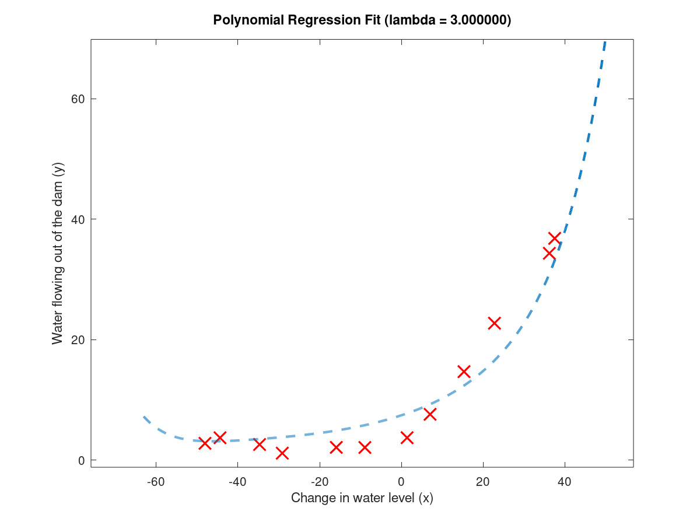
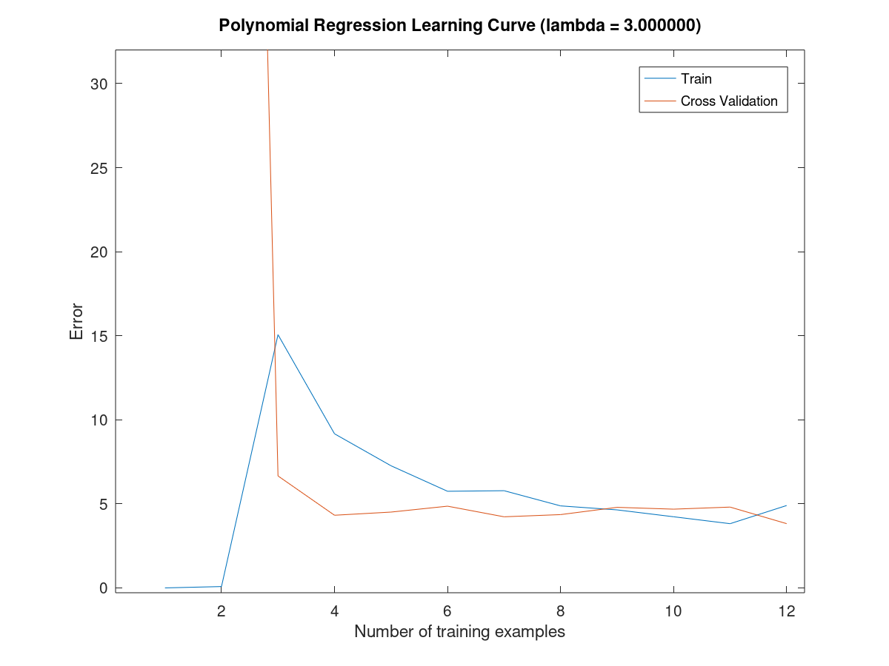

# Exercise 5 (week 6: Regularized Linear Regression and Bias v.s.Variance)

We implement regularized linear regression and use it to study models with different bias-variance properties.

Starting with a simple linear regression fit:
<!---  --->

We observe in the learning curve (below) that the cost function is relatively high both for the training and cross validation sets. The don't decrease with more data (training samples). This is an indication of bias.
<!---  --->

Next step is to increase the number of features by using a polynomial fit (8-dimensional). We start without regularization. 

This fits the training data well, but performs poorly on cross validation. We observe in the learning curve (below) that the cost function for the training set is low, but for the validation set it remains high also for larger training sets. This is an indication of high variance (overfitting)

In order to find a suitable regularization factor, we calculate the validation curve (running optimizations and tests for different lambdas). 

Lambda = 3 appears to be a good choice. This yields:

With our optimal learning curve:

